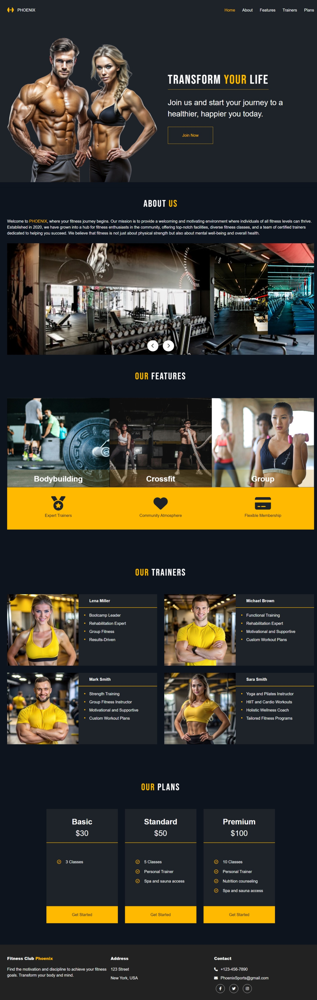

# Gym Website

## Description

This is a website for a fictional gym. The website is responsive and has all necessary blocks for a commercial website. The website includes a home section, an about section, a features section, a trainers section, a plans section, and a contact section.

## Technologies

- HTML
- CSS
- JavaScript

## Features

- Responsive design
- Animated slideshow
- Interactive menu

## Setup

1. Clone the repository
2. Open the `index.html` file in a web browser

## Screenshots

## Contact

For questions or suggestions, please contact me at [email](eduard.dev.de@gmail.com).
